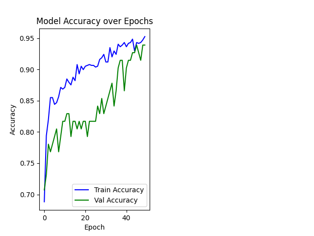
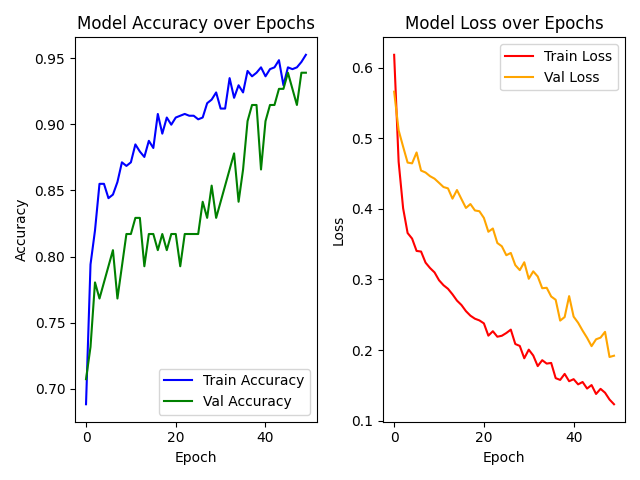

# 🫀 CardioCare: AI Intelligent Heart Health Prediction System

A machine learning and deep learning-based solution to predict the presence of heart disease using medical and lifestyle features. This project leverages TensorFlow, Scikit-learn, and powerful data preprocessing techniques to deliver an effective binary classification model.

## 📌 Project Highlights

🧠 Built using Artificial Neural Networks (ANN) with TensorFlow & Keras
🧼 Cleaned and preprocessed data using StandardScaler and OneHotEncoder
📊 Achieved high accuracy with detailed performance metrics
📈 Visualized model training history (accuracy and loss curves)
🧪 Evaluated with confusion matrix, accuracy score, and classification report
🛠️ Modular code with Scikit-learn Pipelines and ColumnTransformer

## 📂 Dataset

The dataset contains patient-level information like:

Age, Resting Blood Pressure, Cholesterol, Max Heart Rate, etc.
Categorical features like Chest Pain Type, Slope, Thalassemia, and more
Binary target column: target (1 = Heart Disease, 0 = No Heart Disease)
Dataset used: HeartDiseaseTrain-Test.csv

## 🧮 Technologies Used

Tool	Purpose
Python (Pandas, NumPy)	Data handling and preprocessing
Matplotlib / Seaborn	Exploratory Data Analysis & Visualization
Scikit-learn	Data preprocessing, train-test split, metrics
TensorFlow / Keras	Deep learning model building
Pipeline & ColumnTransformer	Clean, reusable ML workflow

## 🧑‍💻 Model Architecture

Input Layer (Preprocessed features)
↓
Dense Layer (64 units, ReLU)
↓
Dropout Layer (rate=0.2)
↓
Dense Layer (32 units, ReLU)
↓
Output Layer (1 unit, Sigmoid)

## 📊 Results

Accuracy: ✅ ~ Achieved strong predictive performance on test data
Confusion Matrix: ✅ Balanced predictions
Classification Report: ✅ Detailed precision, recall, F1-score metrics

## 📸 Visualizations

   

## 🚀 How to Run the Project

Clone the repository
git clone https://github.com/yourusername/heart-disease-prediction.git
cd heart-disease-prediction
Install dependencies
pip install -r requirements.txt
Run the script
python heart_disease_prediction.py

## 📚 What You’ll Learn

How to preprocess real-world medical datasets
How to structure a deep learning project in Python
How to evaluate classification models thoroughly
How to implement modular and clean ML pipelines

## 📌 Future Work

Integrate Flask/Streamlit for web deployment
Add SHAP/Feature importance analysis
Optimize hyperparameters using KerasTuner

## 👤 Author

Shivansh Mehta
AI Researcher | Deep Learning Enthusiast | Android Dev

📫 Connect on LinkedIn (https://www.linkedin.com/in/shivansh-mehta10/) 

📧 shivanshmehta31@gmail.com

⭐️ Star the repo if you find it helpful!

Your support keeps me motivated to build more impactful projects.
